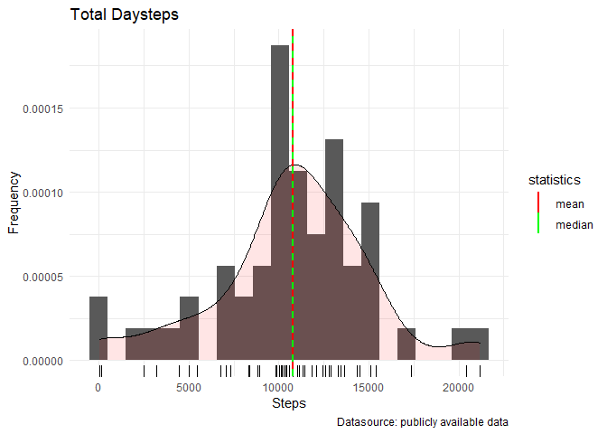
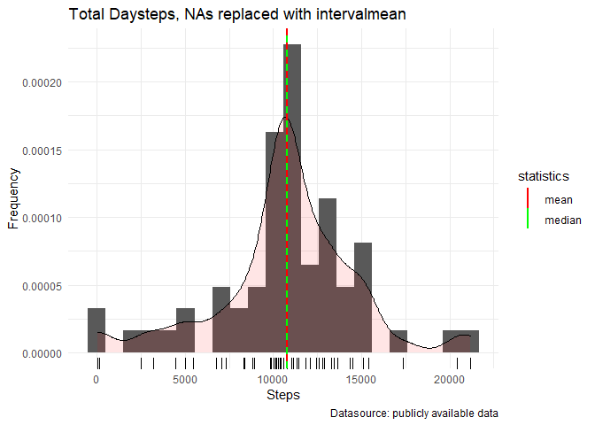

## 1. Loading and preprocessing the data

Show any code that is needed to

### 1.1. Load the data (i.e. read.csv())

Unzip the data:

    #url <- "https://d396qusza40orc.cloudfront.net/repdata%2Fdata%2Factivity.zip"
    #download.file(url, dest="activity.zip", mode="wb") 
    unzip ("activity.zip", exdir = "./activity")

Read the data:

    activity <- read.csv("./activity/activity.csv")

Show the first 6 rows:

    head(activity)

    ##   steps       date interval
    ## 1    NA 2012-10-01        0
    ## 2    NA 2012-10-01        5
    ## 3    NA 2012-10-01       10
    ## 4    NA 2012-10-01       15
    ## 5    NA 2012-10-01       20
    ## 6    NA 2012-10-01       25

### 1.2. Process/transform the data (if necessary) into a format suitable for your analysis

Generate time column from interval column:

    temp <- activity$interval
    temp <- sprintf("%04d", temp)
    interval_time <- format(strptime(temp, format="%H%M"), format = "%H:%M")
    head(interval_time)

    ## [1] "00:00" "00:05" "00:10" "00:15" "00:20" "00:25"

Add time column to dataframe:

    library(dplyr)
    activity_df <- mutate(activity, time=interval_time)
    head(activity_df)

    ##   steps       date interval  time
    ## 1    NA 2012-10-01        0 00:00
    ## 2    NA 2012-10-01        5 00:05
    ## 3    NA 2012-10-01       10 00:10
    ## 4    NA 2012-10-01       15 00:15
    ## 5    NA 2012-10-01       20 00:20
    ## 6    NA 2012-10-01       25 00:25

Add date and time together to a datetime column:

    #library(lubridate)
    activity_df <- mutate(activity_df, datetime=as.POSIXct(as.character(paste(activity_df$date, activity_df$time))))
    head(activity_df)

    ##   steps       date interval  time            datetime
    ## 1    NA 2012-10-01        0 00:00 2012-10-01 00:00:00
    ## 2    NA 2012-10-01        5 00:05 2012-10-01 00:05:00
    ## 3    NA 2012-10-01       10 00:10 2012-10-01 00:10:00
    ## 4    NA 2012-10-01       15 00:15 2012-10-01 00:15:00
    ## 5    NA 2012-10-01       20 00:20 2012-10-01 00:20:00
    ## 6    NA 2012-10-01       25 00:25 2012-10-01 00:25:00

    class(activity_df$datetime)

    ## [1] "POSIXct" "POSIXt"

## 2. What is mean total number of steps taken per day?

For this part of the assignment, you can ignore the missing values in
the dataset.

### 2.1. Calculate the total number of steps taken per day

Calculate the total daysteps:

    totaldaysteps <- aggregate(x = activity_df$steps,
                    by = list(activity_df$date),
                    FUN = sum, na.rm = F)
    names(totaldaysteps)[names(totaldaysteps) == "Group.1"] <- "date"
    names(totaldaysteps)[names(totaldaysteps) == "x"] <- "totaldaysteps"
    head(totaldaysteps)

    ##         date totaldaysteps
    ## 1 2012-10-01            NA
    ## 2 2012-10-02           126
    ## 3 2012-10-03         11352
    ## 4 2012-10-04         12116
    ## 5 2012-10-05         13294
    ## 6 2012-10-06         15420

### 2.2. Make a histogram of the total number of steps taken each day

If you do not understand the difference between a histogram and a
barplot, research the difference between them.

Histogram of the total daysteps:

    library("ggplot2")
    ggplot(totaldaysteps, aes(x = totaldaysteps)) +                           # Draw density above histogram
      geom_histogram(aes(y = ..density..),bins=22) +
      geom_density(alpha = 0.1, fill = "red") + 
      geom_rug() +         # Draw Frequency below x axis
      geom_vline(aes(xintercept=mean(totaldaysteps, na.rm = T),
                 color="mean"), linetype="solid", size=1) +
      geom_vline(aes(xintercept=median(totaldaysteps, na.rm = T),
                 color="median"), linetype="dashed", size=1)+
      labs(x = 'Steps', y = 'Frequency',
           title = 'Total Daysteps',
           caption = 'Datasource: publicly available data')+
      scale_color_manual(
            name = "statistics", 
            values = c(mean = "red", median = "green"))+
      theme_minimal()

### 2.3. Calculate and report the mean and median of the total number of steps taken per day

Calculate and print the mean and median:

    mn <- mean(totaldaysteps$totaldaysteps, na.rm=T)
    md <- median(totaldaysteps$totaldaysteps, na.rm=T)
    print(paste("The mean is: ", round(mn,0), " steps."))
    print(paste("The median is: ", md, " steps."))

Show the summary table:

    library(xtable)
    xt <- xtable(summary(totaldaysteps))
    print(xt, type="html")

<!-- html table generated in R 4.1.0 by xtable 1.8-4 package -->
<!-- Fri Dec 10 20:42:44 2021 -->
<table border="1">
<tr>
<th>
</th>
<th>
date
</th>
<th>
totaldaysteps
</th>
</tr>
<tr>
<td align="right">
X
</td>
<td>
Length:61
</td>
<td>
Min. : 41
</td>
</tr>
<tr>
<td align="right">
X.1
</td>
<td>
Class :character
</td>
<td>
1st Qu.: 8841
</td>
</tr>
<tr>
<td align="right">
X.2
</td>
<td>
Mode :character
</td>
<td>
Median :10765
</td>
</tr>
<tr>
<td align="right">
X.3
</td>
<td>
</td>
<td>
Mean :10766
</td>
</tr>
<tr>
<td align="right">
X.4
</td>
<td>
</td>
<td>
3rd Qu.:13294
</td>
</tr>
<tr>
<td align="right">
X.5
</td>
<td>
</td>
<td>
Max. :21194
</td>
</tr>
<tr>
<td align="right">
X.6
</td>
<td>
</td>
<td>
NA’s :8
</td>
</tr>
</table>

    #print(xt, type="latex")

## 3. What is the average daily activity pattern?

### 3.1. Make a time series plot

Make a time series plot (i.e. type = “l”) of the 5-minute interval
(x-axis) and the average number of steps taken, averaged across all days
(y-axis)

Calculate the average daysteps:

    avgdaysteps <- aggregate(x = activity_df$steps,
                    by = list( activity_df$interval),
                    FUN = mean, na.rm = T)
    names(avgdaysteps)[names(avgdaysteps) == "Group.1"] <- "interval"
    names(avgdaysteps)[names(avgdaysteps) == "x"] <- "avgdaysteps"
    head(avgdaysteps)

    ##   interval avgdaysteps
    ## 1        0   1.7169811
    ## 2        5   0.3396226
    ## 3       10   0.1320755
    ## 4       15   0.1509434
    ## 5       20   0.0754717
    ## 6       25   2.0943396

Time series plot: Average number of steps on 5-minute interval

    ggplot(data = avgdaysteps, aes(x = interval, y = avgdaysteps)) +
    geom_line(color = "#FC4E07", size = 0.5)+
    #geom_rug()+
    labs(x = 'Interval', y = 'Average Daysteps',
           title = 'Average steps per day on 5-minutes interval',
           caption = 'Datasource: publicly available data')+
    theme_minimal()

### 3.2. The 5-minute interval containing the maximum number of steps

Which 5-minute interval, on average across all the days in the dataset,
contains the maximum number of steps?

    #install.packages("dplyr")
    #library("dplyr")
    subset(avgdaysteps,avgdaysteps==max(avgdaysteps))

    ##     interval avgdaysteps
    ## 104      835    206.1698

## 4. Imputing missing values

Note that there are a number of days/intervals where there are missing
values (coded as NA). The presence of missing days may introduce bias
into some calculations or summaries of the data.

### 4.1. Calculate and report the total number of NAs

Calculate and report the total number of missing values in the dataset
(i.e. the total number of rows with NAs)

    print("The total number of missing values in the dataset (in the steps column) is: ")

    ## [1] "The total number of missing values in the dataset (in the steps column) is: "

    sum(is.na(activity_df))

    ## [1] 2304

    #library(xtable)
    xt_activity_df <- xtable(summary(activity_df[1]))
    print(xt_activity_df, type="html")

<!-- html table generated in R 4.1.0 by xtable 1.8-4 package -->
<!-- Fri Dec 10 20:42:44 2021 -->
<table border="1">
<tr>
<th>
</th>
<th>
steps
</th>
</tr>
<tr>
<td align="right">
X
</td>
<td>
Min. : 0.00
</td>
</tr>
<tr>
<td align="right">
X.1
</td>
<td>
1st Qu.: 0.00
</td>
</tr>
<tr>
<td align="right">
X.2
</td>
<td>
Median : 0.00
</td>
</tr>
<tr>
<td align="right">
X.3
</td>
<td>
Mean : 37.38
</td>
</tr>
<tr>
<td align="right">
X.4
</td>
<td>
3rd Qu.: 12.00
</td>
</tr>
<tr>
<td align="right">
X.5
</td>
<td>
Max. :806.00
</td>
</tr>
<tr>
<td align="right">
X.6
</td>
<td>
NA’s :2304
</td>
</tr>
</table>

    #print(xt_activity_df, type="latex")

### 4.2. Filling in all of the missing values in the dataset

Devise a strategy for filling in all of the missing values in the
dataset. The strategy does not need to be sophisticated. For example,
you could use the mean/median for that day, or the mean for that
5-minute interval, etc.

Calculate steps mean for each 5-minutes interval:

    intervalmean <- aggregate(x = activity_df$steps,
                    by = list(activity_df$interval),
                    FUN = mean, na.rm=T)
    names(intervalmean)[names(intervalmean) == "Group.1"] <- "interval"
    names(intervalmean)[names(intervalmean) == "x"] <- "steps_intervalmean"
    head(intervalmean)

    ##   interval steps_intervalmean
    ## 1        0          1.7169811
    ## 2        5          0.3396226
    ## 3       10          0.1320755
    ## 4       15          0.1509434
    ## 5       20          0.0754717
    ## 6       25          2.0943396

    #intervalmean

Calculate steps mean for each date:

    datemean <- aggregate(x = activity_df$steps,
                    by = list(activity_df$date),
                    FUN = mean, na.rm=T)
    names(datemean)[names(datemean) == "Group.1"] <- "date"
    names(datemean)[names(datemean) == "x"] <- "steps_datemean"
    head(datemean)

    ##         date steps_datemean
    ## 1 2012-10-01            NaN
    ## 2 2012-10-02        0.43750
    ## 3 2012-10-03       39.41667
    ## 4 2012-10-04       42.06944
    ## 5 2012-10-05       46.15972
    ## 6 2012-10-06       53.54167

### 4.3. Create a new dataset with the filled in data

Create a new dataset that is equal to the original dataset but with the
missing data filled in.

Join the interval and date mean columns together with the original
dataframe:

    library(dplyr)
    df <- merge(x=activity_df,y=intervalmean,by="interval")
    df <- merge(x=df,y=datemean,by="date")
    head(df)

    ##         date interval steps  time            datetime steps_intervalmean
    ## 1 2012-10-01        0    NA 00:00 2012-10-01 00:00:00           1.716981
    ## 2 2012-10-01      955    NA 09:55 2012-10-01 09:55:00          21.056604
    ## 3 2012-10-01      905    NA 09:05 2012-10-01 09:05:00         124.037736
    ## 4 2012-10-01      125    NA 01:25 2012-10-01 01:25:00           1.113208
    ## 5 2012-10-01      635    NA 06:35 2012-10-01 06:35:00          39.339623
    ## 6 2012-10-01     1455    NA 14:55 2012-10-01 14:55:00          43.773585
    ##   steps_datemean
    ## 1            NaN
    ## 2            NaN
    ## 3            NaN
    ## 4            NaN
    ## 5            NaN
    ## 6            NaN

Fill in the NAs in step column with the interval means:

    df_na_intervalmean <- df
    df_na_intervalmean <- mutate(df_na_intervalmean, steps = ifelse(is.na(df$steps), df$steps_intervalmean, df$steps))
    df_na_intervalmean <- mutate(df_na_intervalmean, steps_datemean = ifelse(is.na(df_na_intervalmean$steps_datemean), mean(df_na_intervalmean$steps_datemean, na.rm = T), df_na_intervalmean$steps_datemean))
    head(df_na_intervalmean)

    ##         date interval      steps  time            datetime steps_intervalmean
    ## 1 2012-10-01        0   1.716981 00:00 2012-10-01 00:00:00           1.716981
    ## 2 2012-10-01      955  21.056604 09:55 2012-10-01 09:55:00          21.056604
    ## 3 2012-10-01      905 124.037736 09:05 2012-10-01 09:05:00         124.037736
    ## 4 2012-10-01      125   1.113208 01:25 2012-10-01 01:25:00           1.113208
    ## 5 2012-10-01      635  39.339623 06:35 2012-10-01 06:35:00          39.339623
    ## 6 2012-10-01     1455  43.773585 14:55 2012-10-01 14:55:00          43.773585
    ##   steps_datemean
    ## 1        37.3826
    ## 2        37.3826
    ## 3        37.3826
    ## 4        37.3826
    ## 5        37.3826
    ## 6        37.3826

### 4.4. Make a histogram of the total number of steps and report the mean and median

Make a histogram of the total number of steps taken each day and
calculate and report the mean and median total number of steps taken per
day. Do these values differ from the estimates from the first part of
the assignment? What is the impact of imputing missing data on the
estimates of the total daily number of steps?

Calculate the total daysteps, Nas replaced with intervalmean:

    totaldaysteps_na_intervalmean <- aggregate(x = df_na_intervalmean$steps,
                    by = list(df_na_intervalmean$date),
                    FUN = sum)
    names(totaldaysteps_na_intervalmean)[names(totaldaysteps_na_intervalmean) == "Group.1"] <- "date"
    names(totaldaysteps_na_intervalmean)[names(totaldaysteps_na_intervalmean) == "x"] <- "totaldaysteps_na_intervalmean"
    head(totaldaysteps_na_intervalmean)

    ##         date totaldaysteps_na_intervalmean
    ## 1 2012-10-01                      10766.19
    ## 2 2012-10-02                        126.00
    ## 3 2012-10-03                      11352.00
    ## 4 2012-10-04                      12116.00
    ## 5 2012-10-05                      13294.00
    ## 6 2012-10-06                      15420.00

Histogramm of totaldaysteps, NAs replaced with intervalmean:

    library("ggplot2")
    ggplot(totaldaysteps_na_intervalmean, aes(x = totaldaysteps_na_intervalmean)) +                           # Draw density above histogram
      geom_histogram(aes(y = ..density..), bins = 22) +
      geom_density(alpha = 0.1, fill = "red") + 
      geom_rug() +         # Draw Frequency below x axis
      geom_vline(aes(xintercept=mean(totaldaysteps_na_intervalmean),
                 color="mean"), linetype="solid", size=1) +
      geom_vline(aes(xintercept=median(totaldaysteps_na_intervalmean),
                 color="median"), linetype="dashed", size=1)+
      labs(x = 'Steps', y = 'Frequency',
           title = 'Total Daysteps, NAs replaced with intervalmean',
           caption = 'Datasource: publicly available data')+
      scale_color_manual(
            name = "statistics", 
            values = c(mean = "red", median = "green"))

Report the mean and median total number of steps taken per day:

Calculate and print the mean and median:

    mn <- mean(totaldaysteps$totaldaysteps, na.rm=T)
    md <- median(totaldaysteps$totaldaysteps, na.rm=T)
    mn_na_intervalmean <- mean(totaldaysteps_na_intervalmean$totaldaysteps_na_intervalmean, na.rm=T)
    md_na_intervalmean <- median(totaldaysteps_na_intervalmean$totaldaysteps_na_intervalmean, na.rm=T)
    print(paste("The mean is: ", round(mn,2), " steps."))
    print(paste("The mean (NAs replaced by intervalmean) is: ", round(mn_na_intervalmean,2), " steps."))
    print(paste("The median is: ", round(md,2), " steps."))
    print(paste("The median (NAs replaced by intervalmean) is: ", round(md_na_intervalmean,2), " steps."))

Show the summary table:

    library(xtable)
    xt_na <- xtable(summary(totaldaysteps_na_intervalmean))
    print(xt_na, type="html")

<!-- html table generated in R 4.1.0 by xtable 1.8-4 package -->
<!-- Fri Dec 10 20:42:45 2021 -->
<table border="1">
<tr>
<th>
</th>
<th>
date
</th>
<th>
totaldaysteps\_na\_intervalmean
</th>
</tr>
<tr>
<td align="right">
X
</td>
<td>
Length:61
</td>
<td>
Min. : 41
</td>
</tr>
<tr>
<td align="right">
X.1
</td>
<td>
Class :character
</td>
<td>
1st Qu.: 9819
</td>
</tr>
<tr>
<td align="right">
X.2
</td>
<td>
Mode :character
</td>
<td>
Median :10766
</td>
</tr>
<tr>
<td align="right">
X.3
</td>
<td>
</td>
<td>
Mean :10766
</td>
</tr>
<tr>
<td align="right">
X.4
</td>
<td>
</td>
<td>
3rd Qu.:12811
</td>
</tr>
<tr>
<td align="right">
X.5
</td>
<td>
</td>
<td>
Max. :21194
</td>
</tr>
</table>

    #print(xt_na, type="latex")

## 5. Are there differences in activity patterns between weekdays and weekends?

For this part the weekdays() function may be of some help here. Use the
dataset with the filled-in missing values for this part.

### 5.1. Create “weekday” and “weekend” of the date

Create a new factor variable in the dataset with two levels – “weekday”
and “weekend” indicating whether a given date is a weekday or weekend
day.

Create weekdays from date and than the factor variable with the two
levels – “weekday” and “weekend”:

    df_na_intervalmean <- mutate(df_na_intervalmean, date = as.POSIXct(date))
    df_na_intervalmean <- mutate(df_na_intervalmean, weekdays = weekdays(date))
    df_na_intervalmean[grepl(pattern = "Montag|Dienstag|Mittwoch|Donnerstag|Freitag", x =df_na_intervalmean$weekdays), "weekday_weekend"] <- "weekday"
    df_na_intervalmean[grepl(pattern = "Samstag|Sontag", x =df_na_intervalmean$weekdays), "weekday_weekend"] <- "weekend"
    df_na_intervalmean$weekday_weekend <- as.factor(df_na_intervalmean$weekday_weekend)
    #class(df_na_intervalmean$weekday_weekend)
    head(df_na_intervalmean, 10)

    ##          date interval       steps  time            datetime steps_intervalmean
    ## 1  2012-10-01        0   1.7169811 00:00 2012-10-01 00:00:00          1.7169811
    ## 2  2012-10-01      955  21.0566038 09:55 2012-10-01 09:55:00         21.0566038
    ## 3  2012-10-01      905 124.0377358 09:05 2012-10-01 09:05:00        124.0377358
    ## 4  2012-10-01      125   1.1132075 01:25 2012-10-01 01:25:00          1.1132075
    ## 5  2012-10-01      635  39.3396226 06:35 2012-10-01 06:35:00         39.3396226
    ## 6  2012-10-01     1455  43.7735849 14:55 2012-10-01 14:55:00         43.7735849
    ## 7  2012-10-01       10   0.1320755 00:10 2012-10-01 00:10:00          0.1320755
    ## 8  2012-10-01     2250   1.6037736 22:50 2012-10-01 22:50:00          1.6037736
    ## 9  2012-10-01      930  66.2075472 09:30 2012-10-01 09:30:00         66.2075472
    ## 10 2012-10-01     2025  21.1698113 20:25 2012-10-01 20:25:00         21.1698113
    ##    steps_datemean weekdays weekday_weekend
    ## 1         37.3826   Montag         weekday
    ## 2         37.3826   Montag         weekday
    ## 3         37.3826   Montag         weekday
    ## 4         37.3826   Montag         weekday
    ## 5         37.3826   Montag         weekday
    ## 6         37.3826   Montag         weekday
    ## 7         37.3826   Montag         weekday
    ## 8         37.3826   Montag         weekday
    ## 9         37.3826   Montag         weekday
    ## 10        37.3826   Montag         weekday

### 5.2. Make a panel plot time series of the 5-minute interval and the average number of steps

Make a panel plot containing a time series plot (i.e. type = “l”) of the
5-minute interval (x-axis) and the average number of steps taken,
averaged across all weekday days or weekend days (y-axis). See the
README file in the GitHub repository to see an example of what this plot
should look like using simulated data.

Calculate the average daysteps:

    avgdaysteps_na_intervalmean <- aggregate(x = df_na_intervalmean$steps,
                    by = list( df_na_intervalmean$interval, df_na_intervalmean$weekday_weekend),
                    FUN = mean, na.rm = T)
    names(avgdaysteps_na_intervalmean)[names(avgdaysteps_na_intervalmean) == "Group.1"] <- "interval"
    names(avgdaysteps_na_intervalmean)[names(avgdaysteps_na_intervalmean) == "Group.2"] <- "weekday_weekend"
    names(avgdaysteps_na_intervalmean)[names(avgdaysteps_na_intervalmean) == "x"] <- "avgdaysteps_na_intervalmean"
    head(avgdaysteps_na_intervalmean)

    ##   interval weekday_weekend avgdaysteps_na_intervalmean
    ## 1        0         weekday                  2.25115304
    ## 2        5         weekday                  0.44528302
    ## 3       10         weekday                  0.17316562
    ## 4       15         weekday                  0.19790356
    ## 5       20         weekday                  0.09895178
    ## 6       25         weekday                  1.59035639

Panal of time series plots: Average daysteps on 5-minutes interval by
type of the weekday:

    ggplot(avgdaysteps_na_intervalmean, aes(x=interval, y=avgdaysteps_na_intervalmean, color=weekday_weekend)) + 
    geom_line(size = 1) + 
    facet_wrap(~weekday_weekend,  ncol = 1, nrow=2) +
    labs(title = 'Average daysteps on 5-minutes interval',
         subtitle="by type of the weekday",
           x = "Interval",
           y = "Average daysteps",
         color="Type of the weekday:",
           caption = 'Datasource: publicly available data')+
    theme_minimal()

## 6. Commit containing full submission

All of the R code needed to reproduce the results (numbers, plots, etc.)
in the report must be submitted.
